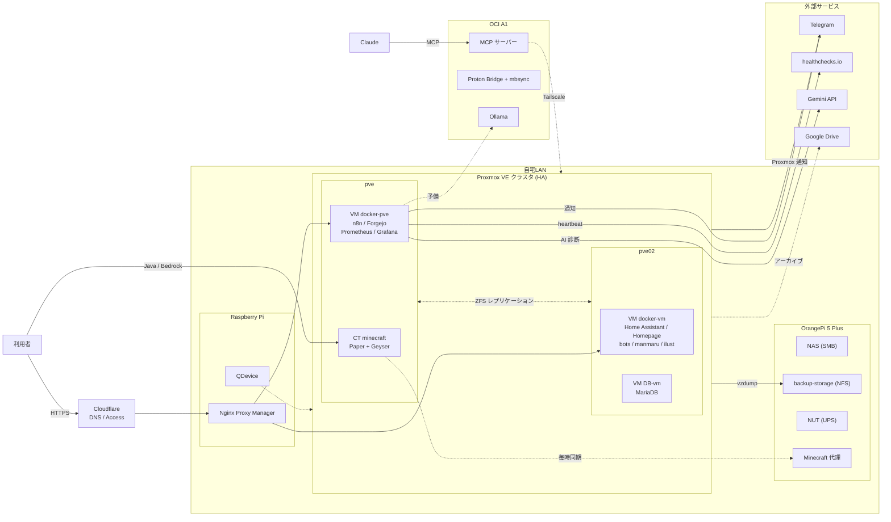

# 鯖 (Homelab)

自宅で運用している Proxmox ベースのホームラボの構成と運用のまとめ。
物理ホスト2台の Proxmox クラスタ + Raspberry Pi + OrangePi + リモートの OCI インスタンス1台で、
セルフホストサービス・ゲームサーバー・監視と自動化の基盤を動かしている。

このリポジトリには、各サービスの `compose.yaml`・自前イメージの `Dockerfile`・構成管理の Ansible を収録している。
秘密情報や内部アドレスは `${VAR}` 参照に置き換えており、**リポジトリ自体には含めない**。

## 構成図



編集できる版は [`docs/architecture.drawio`](docs/architecture.drawio)(draw.io / diagrams.net で開く)。

## 設計方針

- **しばらく触れなくても動き続ける**: セキュリティ更新は自動、壊れたら自動で再起動・通知、止まったことに外から気づける。
- **作り直せる**: 設定は Ansible、サービスは compose / Dockerfile にしておき、データはバックアップから戻す。
- **サービスは Docker に統一**: VM 上の `/opt/stacks/<スタック>/` に compose 単位で置く。LXC はマイクラと VPN 検証だけ。
- **冗長化は安く**: 共有ストレージは使わず、ZFS レプリケーション + Proxmox HA で片方のホストが落ちても再開する。

## ホスト

| ホスト | 役割 |
|---|---|
| pve | Proxmox ノード(デスクトップ機) |
| pve02 | Proxmox ノード(ノートPC) |
| Raspberry Pi | リバースプロキシ(NPM)、クラスタの QDevice |
| OrangePi 5 Plus | NAS、バックアップ置き場、UPS の NUT サーバー、Minecraft の代理サーバー |
| mcp-a1 (OCI A1) | MCP サーバー、メール集約、Ollama |

## ゲスト

| 種類 | 名前 | 通常のホスト | HA | 役割 |
|---|---|---|---|---|
| VM | docker-pve | pve | ○ | n8n、Forgejo(GitHub のミラー)、Prometheus、Grafana、nut-exporter |
| VM | docker-vm | pve02 | ○ | Home Assistant、Matter、Homepage、bot 類、manmaru、ilust |
| VM | DB-vm | pve02 | ○ | MariaDB |
| CT | minecraft | pve | - | PaperMC + Geyser/Floodgate(Java/統合版のクロスプレイ) |
| CT | vpn-lab | pve | - | VPN 検証 |

## スタック一覧

`stacks/<ホスト>/<スタック>/` がサーバーの `/opt/stacks/<スタック>/` に対応する。

| ホスト | スタック | 内容 |
|---|---|---|
| docker-pve | monitoring | nut-exporter、Prometheus、Grafana(内部ネットワークでサービス名で接続) |
| docker-pve | forgejo | Forgejo(rootless イメージ、GitHub の全リポジトリのプルミラー) |
| docker-pve | n8n | n8n |
| docker-vm | discord-bots | everyone-bot、wol-bot(host network)、rolepanel-bot(共通の自前イメージ) |
| docker-vm | telegram-cmd-bot | Telegram から状態確認・更新操作をする bot |
| docker-vm | manmaru | 告知 bot + Web 管理パネル(FastAPI) |
| docker-vm | ilust | ギャラリー(Node)+ いいね画像の取得(gallery-dl、30分毎) |
| docker-vm | homeassistant / homepage | - |
| db-vm | mariadb | Forgejo と監視ログの DB |
| mcp-a1 | mcp / mail-sync / ollama | MCP サーバー、Proton Bridge + mbsync、Ollama |
| pi | npm | Nginx Proxy Manager |
| 各 Docker ホスト | docker-proxy | 更新チェック用の Docker API(送信元を ACL で限定) |

## 冗長化

- **HA**: VM 3台は ZFS(`hapool`)上にあり、相手ノードへ2分毎にレプリケーション。ノードが落ちると生き残った側で自動再開する(実測でおよそ5〜8分)。計画的な移動はライブマイグレーションで停止 0.1 秒未満。
- **定足数**: pve・pve02・QDevice(Raspberry Pi)の3票。どれか1台が落ちても過半数を保つ。
- **停電**: UPS を OrangePi の NUT が監視する。バッテリー運転が続くと pve02(5分)・pve(6分)が先に停止し、残量低下で残りも停止する。
- **Minecraft**: HA の対象外。OrangePi に毎時同期した代理サーバーを、Telegram のコマンドで手動で切り替える。
- **AI 診断**: Gemini が主、OCI A1 の Ollama が予備。両方ダメでも通知自体は届く。

## バックアップ

| 時刻 | 内容 | 保存先 |
|---|---|---|
| 01:45 | MariaDB の論理ダンプ | backup-storage |
| 02:00 | Minecraft のワールドバックアップのミラー | backup-storage |
| 03:00 | 各ホストの設定(etckeeper・スクリプト・Ansible・スタック) | backup-storage |
| 03:15 | OrangePi の設定 | backup-storage |
| 03:30 | NAS 共有のミラー(コピー元が未マウントなら中止) | backup-storage |
| 04:00 | 全ゲストの vzdump(snapshot モード、keep-daily=3、keep-weekly=2) | backup-storage |
| 05:30 | Minecraft ワールド(30日分) | pve ローカル → ミラー |
| 毎時 | Minecraft の代理サーバーへの同期 | OrangePi |

- 各ジョブは healthchecks.io に開始・成功・失敗を送る。**失敗したときも、そもそも動かなかったときも**外から検知できる。
- 廃止したゲストは最終ダンプを1つだけ残し、パスワード付き 7z(AES-256・ファイル名も暗号化)にして Google Drive にも保管する。

## 監視と自動化

- **Status Monitor(n8n)**: 1分毎に HTTP/TCP で各サービスを確認し、変化したときだけ Telegram に通知(AI 診断付き)。Cloudflare Access の裏にある管理画面は LAN 側を直接確認する。公開 URL は3回連続の失敗で通知し、外部経路だけの一斉障害は1通にまとめる。`/maintenance 30m` で作業中の通知を止められる。
- **Kuma Fix(n8n)**: 通知の「修正」ボタンから、監視ごとに決めた固定の復旧コマンド(`docker restart` など)を実行して再確認する。
- **Proxmox の通知**: 警告・エラー・フェンス・root 宛てメール(smartd・ZFS)を Webhook で Telegram へ。
- **UPS**: バッテリー運転・残量低下・交換要求・状態取得不可を通知。
- **容量**: 毎時、全ホストのディスク・thin プール・ZFS の使用率を確認し、しきい値を超えたら通知。
- **更新チェック**: Docker イメージ(n8n の Image Update Check、6時間毎)、アプリと OS パッケージ(Native Update Check、毎日)、OCI 側のイメージ(毎週)。反映はボタンか手動。
- **自前イメージの作り直し**: 毎月1日に土台のイメージを最新にしてビルドし直す。
- **構成のずれ検知**: 毎週 Ansible を試走し、ずれや到達できないホストがあれば通知する。
- **死活の外部確認**: n8n・MCP サーバー・メール同期は healthchecks.io に定期的に報告する。止まったら外から分かる。

## 構成管理(Ansible)

```sh
cd ansible
cp inventory.example.yml inventory.yml
ansible-playbook site.yml --check --diff
ansible-playbook site.yml
ansible-playbook fetch-stacks.yml
```

| ロール | 内容 |
|---|---|
| common | タイムゾーン、ロケール、セキュリティ更新の自動適用、SSH の硬化 |
| lxc | wait-online のマスク、SSH は常駐型に統一 |
| docker | `daemon.json`(ログの上限・MTU)、Docker API の ACL |

新しいサーバーは、インベントリに追加して `site.yml` を流せば共通の設定が入る。作り直すときは `stacks/` からスタックを置き、データをバックアップから戻す。

## セキュリティ

- 外部に公開しているのは HTTPS(Cloudflare 経由)と Minecraft の2ポートだけ。SSH は外部非公開。
- リバースプロキシは Cloudflare からの接続だけを受け付け、オリジンへの直接アクセスは拒否する。管理画面は Cloudflare Access で保護。
- MCP サーバーの公開ポートは、Anthropic の送信元アドレスからの接続だけに限定。
- SSH はパスワード認証を無効化(一部のホストは運用上の理由で除外)。自動処理用の鍵は送信元とコマンドを限定する。
- Docker API は送信元を ACL で限定し、IPv6 側は遮断。
- 秘密情報は各スタックの `.env`(600)にだけ置く。

## リポジトリ構成

```
stacks/<ホスト>/<スタック>/   compose.yaml、Dockerfile、requirements.txt
ansible/                      ロール、site.yml、インベントリの見本
docs/architecture.drawio      構成図(draw.io)
.env.example                  compose が参照する変数の一覧
```

## 使い方

各スタックはそのまま `docker compose up -d` できる形だが、`${VAR}` の実値と各スタックの `.env` は自分で用意すること(`.env.example` を参照)。

## 関連リポジトリ

- [mcp](https://github.com/Leucophyllous/mcp) - Claude 用 MCP サーバー(SSH / Proxmox / OCI / Proton Calendar)
- [manmaru](https://github.com/Leucophyllous/manmaru) - 告知 bot
- [quakebot](https://github.com/Leucophyllous/quakebot) / [everyone-bot](https://github.com/Leucophyllous/everyone-bot) / [rolepanel](https://github.com/Leucophyllous/rolepanel) - Discord bot 群
- [ilust](https://github.com/Leucophyllous/ilust) / [media](https://github.com/Leucophyllous/media)
