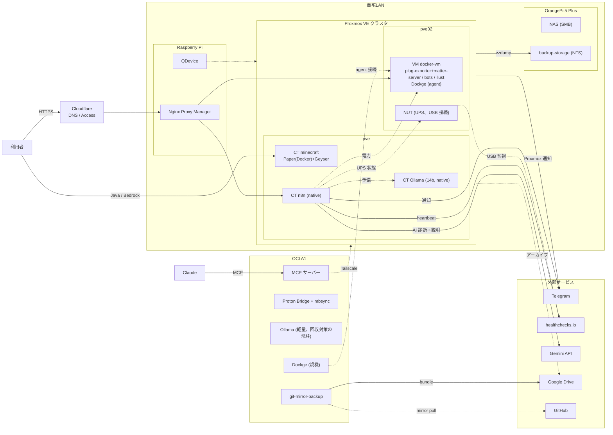

# 鯖 (Homelab)

自宅で運用している Proxmox ベースのホームラボの構成と運用のまとめ。
物理ホスト2台の Proxmox クラスタ + Raspberry Pi + OrangePi + リモートの OCI インスタンス1台で、
セルフホストサービス・ゲームサーバー・監視と自動化の基盤を動かしている。

このリポジトリには、各サービスの `compose.yaml`・自前イメージの `Dockerfile`・構成管理の Ansible を収録している。
秘密情報(パスワード・トークン・通知用の URL など)は `${VAR}` 参照や git 管理外の `ansible/host_vars/*/local.yml` に分けており、**リポジトリ自体には含めない**。LAN 内のアドレス(外部からは到達できない)はインベントリの見本やスクリプトにそのまま含まれる。

## 構成図


```mermaid
flowchart LR
  user["利用者"] -->|HTTPS| cf["Cloudflare<br>DNS / Access"]
  user -->|Java / Bedrock| mc
  claude["Claude"] -->|MCP| mcp

  subgraph home["自宅LAN"]
    subgraph pi["Raspberry Pi"]
      npm["Nginx Proxy Manager"]
      qd["QDevice"]
    end
    subgraph cluster["Proxmox VE クラスタ"]
      subgraph pve["pve"]
        n8n["CT n8n (native)"]
        oll2["CT Ollama (14b, native)"]
        mc["CT minecraft<br>Paper(Docker)+Geyser"]
      end
      subgraph pve02["pve02"]
        dvm["VM docker-vm<br>plug-exporter+matter-server / bots / ilust<br>Dockge (agent)"]
        nut["NUT (UPS、USB 接続)"]
      end
    end
    subgraph opi["OrangePi 5 Plus"]
      nas["NAS (SMB)"]
      bs["backup-storage (NFS)"]
    end
  end

  subgraph oci["OCI A1"]
    mcp["MCP サーバー"]
    mail["Proton Bridge + mbsync"]
    oll["Ollama (軽量、回収対策の常駐)"]
    dockge["Dockge (親機)"]
    gm["git-mirror-backup"]
  end

  subgraph saas["外部サービス"]
    tg["Telegram"]
    hc["healthchecks.io"]
    gem["Gemini API"]
    gd["Google Drive"]
    gh["GitHub"]
  end

  cf --> npm
  npm --> dvm
  npm --> n8n
  qd -.-> cluster
  cluster -->|vzdump| bs
  n8n -->|通知| tg
  n8n -.->|UPS 状態| nut
  n8n -.->|電力| dvm
  cluster -->|Proxmox 通知| tg
  n8n -->|AI 診断・説明| gem
  n8n -.->|予備| oll2
  n8n -->|heartbeat| hc
  nut -.->|USB 監視| hc
  gm -->|bundle| gd
  gm -.->|mirror pull| gh
  cluster -.->|アーカイブ| gd
  dockge -.->|agent 接続| dvm
  mcp -.->|Tailscale| cluster
```

## 設計方針

- **しばらく触れなくても動き続ける**: セキュリティ更新は自動、壊れたら自動で再起動・通知、止まったことに外から気づける。
- **作り直せる**: 設定は Ansible、サービスは compose / Dockerfile にしておき、データはバックアップから戻す。
- **1サービス1つだけ**: 予備のコンテナ・予備のサーバー・自動フェイルオーバーは持たない。各ホスト(pve・pve02・Raspberry Pi・OrangePi)は単独で動き続け、壊れたら通知してバックアップから戻す。クラスタは管理の一元化とライブマイグレーションのために維持する。
- **監視は n8n と通知中心**: 異常や警告の段階で Telegram に届ける。Grafana・Prometheus・node_exporter などの常駐の可視化基盤は持たず、見たいときはコンソールから確認する。
- **重い/常駐の仕事は Proxmox ネイティブ(CT/VM)、Docker は軽い層に限定**: pve 自体には Docker を置かず、CT で n8n・Ollama をネイティブに動かす。Docker はハードウェア直結でない層をまとめて `docker-vm`(pve02 固定)1台に集約する。マイクラの Paper だけは「更新のしやすさ」を優先して CT 内に Docker をネストする例外。
- **プライベートな Git ホストは持たない**: GitHub の非公開リポジトリのみを使い、A1 の `git-mirror-backup` が全リポジトリを bundle 化してオフサイト(OrangePi/Google Drive)に退避する。

## ホスト

| ホスト | 役割 |
|---|---|
| pve | Proxmox ノード(デスクトップ機)。n8n・Ollama・Minecraft を CT で動かす |
| pve02 | Proxmox ノード(ノートPC、SSD換装済み)。Docker ワークロードの本拠地(docker-vm)、UPS を USB でつなぐ NUT サーバー |
| Raspberry Pi | リバースプロキシ(NPM)、クラスタの QDevice |
| OrangePi 5 Plus | NAS、バックアップ置き場、UPS イベントの Telegram 通知(NUT の従) |
| mcp-a1 (OCI A1) | MCP サーバー、メール集約、軽量 Ollama(アイドル回収を避けるためメモリ使用率を保つ役も兼ねる)、Dockge(親機)、cloudflared Tunnel、GitHub ミラーバックアップ、一部の家族向け Web サービス |

## ゲスト

| 種類 | 名前 | ホスト | 役割 |
|---|---|---|---|
| VM | docker-vm | pve02(固定) | plug-exporter(Matter プラグの電力取得と ON/OFF)、bot 類、ilust、Dockge(agent) |
| CT | n8n (ct142) | pve | n8n(ネイティブ、systemd)。監視・自動修復・通知の実行元 |
| CT | ollama (ct146) | pve | Ollama(ネイティブ、qwen2.5:14b)。n8n の AI 診断フォールバック |
| CT | minecraft (ct121) | pve | PaperMC + Geyser/Floodgate(Java/統合版のクロスプレイ)。Paper 本体のみ Docker(itzg イメージ) |
| CT | vpn-lab | pve | VPN 検証 |

## スタック一覧

`stacks/<ホスト>/<スタック>/` がサーバーの `/opt/stacks/<スタック>/` に対応する。CT の n8n・Ollama はネイティブ稼働のため対象外。

| ホスト | スタック | 内容 |
|---|---|---|
| docker-vm | plugs | Matter プラグ(UPS 入力)の電力を返す plug-exporterと、その元になる matter-server。n8n の UPS 異常チェックが電力を取得し、Telegram の `/plug` から ON/OFF |
| docker-vm | dockge | Docker 管理 UI(agent、親機は A1) |
| docker-vm | discord-bots | wol-bot(host network、自前イメージ) |
| docker-vm | telegram-cmd-bot | Telegram から状態確認・更新操作・プラグ操作をする bot |
| docker-vm | ilust | ギャラリー(Node)+ いいね画像の取得(gallery-dl、30分毎) |
| mcp-a1 | mcp / mail-sync / ollama | MCP サーバー、Proton Bridge + mbsync、Ollama(軽量モデル。回収対策の常駐を兼ねる) |
| mcp-a1 | dockge | Docker 管理 UI(親機)。docker-vm・minecraft CT・Raspberry Pi の Dockge を agent として1画面に集約 |
| pi | npm | Nginx Proxy Manager |
| pi | dockge | Docker 管理 UI(agent) |
| 各 Docker ホスト | docker-proxy | 更新チェック用の Docker API(送信元を ACL で限定) |

## 障害時の考え方

- **自動フェイルオーバーはしない**: Proxmox HA と ZFS レプリケーションは使わない。ホストが落ちたら通知が飛び、vzdump のバックアップから戻す。pve02 を作り直すときは、docker-vm を vzdump で退避してから復元する(`rebuild-pve02.sh`)。
- **定足数**: pve・pve02・QDevice(Raspberry Pi)の3票。どれか1台が落ちても過半数を保つので、残った側でクラスタ操作ができる。
- **バックアップ置き場が止まったとき**: backup-storage(NFS)は `soft` マウント。OrangePi が落ちていても pve/pve02 の操作はハングせず、その間の vzdump だけが失敗として通知される。
- **停電**: UPS は pve02 に USB でつなぎ、pve02 の NUT が主として監視する(pve・OrangePi・Raspberry Pi は従)。バッテリー運転が続くと pve02(5分)・pve(6分)が停止し、主がいなくなった時点で従も停止する。USB が抜けて NUT が古い値を返し続ける状態は、healthchecks.io の `ups-usb`(5分毎)で検知する。
- **AI 診断**: Gemini が主(429/503 のときは5秒間隔で3回まで再試行)、CT の Ollama(14b、常駐)が予備。両方ダメでも通知自体は届く。
- **A1 のアイドル回収**: OCI の Always Free は使用率が低い状態が続くと回収されることがある(CPU・ネットワーク・メモリがすべて 20% 未満)。A1 の軽量 Ollama はモデルを常駐させてメモリ使用率を 20% 超に保つ役を兼ねるため、外すなら先に Pay As You Go へ切り替える(無料枠内なら 0 円で回収の対象外になる)。メモリ使用率が 23% を下回ると `health-check` が警告する。

## バックアップ

| 時刻 | 内容 | 保存先 |
|---|---|---|
| 02:00 | Minecraft のワールドバックアップのミラー | backup-storage |
| 03:00 | 各ホストの設定(etckeeper・スクリプト・Ansible・スタック) | backup-storage |
| 03:15 | OrangePi の設定 | backup-storage |
| 03:30 | GitHub 全リポジトリのミラー bundle 化(A1) | OrangePi 経由でオフサイト |
| 03:30 | NAS 共有のミラー(コピー元が未マウントなら中止) | backup-storage |
| 04:00 | 全ゲストの vzdump(snapshot モード、keep-daily=3、keep-weekly=2、n8n/Ollama の CT も対象) | backup-storage |
| 05:30 | Minecraft ワールド(30日分) | pve ローカル → ミラー |

- 各ジョブは healthchecks.io に開始・成功・失敗を送る。**失敗したときも、そもそも動かなかったときも**外から検知できる。
- 廃止したゲストは最終ダンプを1つだけ残し、パスワード付き 7z(AES-256・ファイル名も暗号化)にして Google Drive にも保管する。

## 監視と自動化

- **Status Monitor(n8n)**: 1分毎に HTTP/TCP で各サービスを確認し、変化したときだけ Telegram に通知(AI 診断付き)。Cloudflare Access の裏にある管理画面は LAN 側を直接確認する。公開 URL・Tailscale 経由の監視は3回連続の失敗、LAN 内は2回連続で通知し、外部経路だけの一斉障害は1通にまとめる。`/maintenance 30m` で作業中の通知を止められる。
- **Kuma Fix(n8n)**: 通知の「修正」ボタンから、監視ごとに決めた固定の復旧コマンド(`docker restart` など)を実行して再確認する。
- **AI 活動ログ(n8n)**: Gemini/Ollama の診断と Kuma Fix の修復結果を、pve の `/root/scripts/ai-activity.log` に JSON Lines で1行ずつ集約する(`AI Activity Log` ワークフロー経由、週次ローテーション)。
- **Proxmox の通知**: 警告・エラー・フェンス・root 宛てメール(smartd・ZFS)を Webhook で Telegram へ。
- **UPS(n8n の UPS Power Anomaly Check、15分毎)**: UPS の状態(バッテリー運転 OB・残量低下 LB・交換要求 RB)を pve02 の NUT に直接問い合わせ、変化したときだけ通知する。消費電力は plug-exporter から直接読み、過去7日分の値を n8n 内に貯めて平均・標準偏差から異常を検知する(2回連続で通知、履歴が2日分たまるまでは電力の異常検知を待機、vzdump の時間帯は除外)。プラグの ON/OFF は Telegram の `/plug`(実行前に確認)で行う。USB が抜けて値が古いまま止まる状態も、pve02 の `ups-usb-check`(5分毎)が healthchecks.io に知らせる。
- **容量**: 毎時、全ホストと稼働中 CT のディスク・thin プール・ZFS の使用率を確認し、しきい値を超えたら通知。
- **ホスト状態(health-check)**: 10分毎に、全ホストと CT のメモリ空き・負荷・温度、pve/pve02 の SMART、Docker コンテナの異常(停止・unhealthy・再起動ループ)、A1 のメモリ使用率(OCI の回収基準に近づいたとき)を確認し、2回連続で異常なら Telegram に通知する。解消したときも1通送る。exporter を各ホストに入れず、pve から SSH で読むだけにしている。
- **更新チェック**: Docker イメージ(n8n の Image Update Check、6時間毎)、アプリと OS パッケージ(Native Update Check、毎日。取得エラーは3回連続で通知)、OCI 側のイメージ(毎週。ローカルビルドは対象外、取得失敗は2回連続で通知、同じ内容は14日間再通知しない)。反映はボタンか手動。
- **自前イメージの作り直し**: 毎月1日に土台のイメージを最新にしてビルドし直す。
- **構成のずれ検知**: 毎週 Ansible を試走し、ずれや到達できないホストがあれば通知する。
- **死活の外部確認**: n8n・MCP サーバー・メール同期・GitHub ミラー・UPS の USB 接続・ホスト状態チェックは healthchecks.io に定期的に報告する。止まったら外から分かる。

## 構成管理(Ansible)

```sh
cd ansible
cp inventory.example.yml inventory.yml
ansible-playbook site.yml --check --diff
ansible-playbook site.yml
ansible-playbook fetch-stacks.yml
```

秘密情報(NUT のパスワード、healthchecks の URL、Telegram のトークンなど)は `host_vars/<ホスト>/local.yml`(git 管理外)に置く。

| ロール | 内容 |
|---|---|
| common | タイムゾーン、ロケール、セキュリティ更新の自動適用、SSH の硬化 |
| lxc | wait-online のマスク、SSH は常駐型に統一 |
| docker | `daemon.json`(ログの上限・MTU)、Docker API の ACL |
| pve_host | pve/pve02 ホスト自体の監視・バックアップ・電源/ネットワークの調整、NUT(`nut_primary` のホストが主、他は従)、クロスホスト SSH 用の known_hosts 配布 |
| orangepi | NUT の従設定とバッテリーイベント通知、設定の日次バックアップ |
| oci_host | mcp-a1(MCP サーバー・メール同期)の死活監視と自己修復 |

新しいサーバーは、インベントリに追加して `site.yml` を流せば共通の設定が入る。作り直すときは `stacks/` からスタックを置き、データをバックアップから戻す。

## セキュリティ

- 外部に公開しているのは HTTPS(Cloudflare 経由)と Minecraft の2ポートだけ。SSH は外部非公開。
- リバースプロキシは Cloudflare からの接続だけを受け付け、オリジンへの直接アクセスは拒否する。管理画面(n8n・Dockge など)は Cloudflare Access で保護。
- MCP サーバーの公開ポートは、Anthropic の送信元アドレスからの接続だけに限定。
- SSH はパスワード認証を無効化(一部のホストは運用上の理由で除外)。自動処理用の鍵は送信元とコマンドを限定する。
- Docker API は送信元を ACL で限定し、IPv6 側は遮断。
- 秘密情報は各スタックの `.env`(600)にだけ置く。

## リポジトリ構成

```
stacks/<ホスト>/<スタック>/   compose.yaml、Dockerfile、requirements.txt
ansible/                      ロール、site.yml、インベントリの見本
.env.example                  compose が参照する変数の一覧
```

## 使い方

各スタックはそのまま `docker compose up -d` できる形だが、`${VAR}` の実値と各スタックの `.env` は自分で用意すること(`.env.example` を参照)。

## 関連リポジトリ

- [mcp](https://github.com/Leucophyllous/mcp) - Claude 用 MCP サーバー(SSH / Proxmox / OCI / Proton Calendar)
- [manmaru](https://github.com/Leucophyllous/manmaru) - 告知 bot
- [quakebot](https://github.com/Leucophyllous/quakebot) / [everyone-bot](https://github.com/Leucophyllous/everyone-bot) / [rolepanel](https://github.com/Leucophyllous/rolepanel) - Discord bot 群
- [ilust](https://github.com/Leucophyllous/ilust) / [media](https://github.com/Leucophyllous/media)
